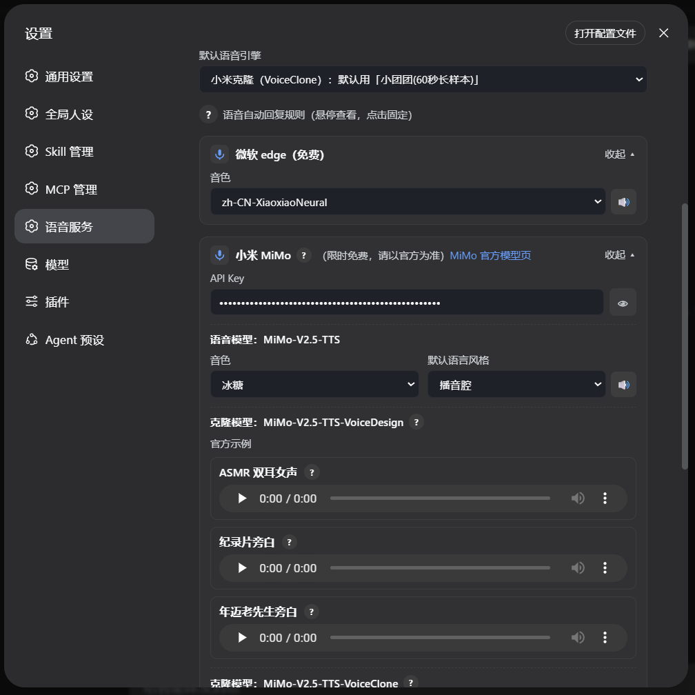
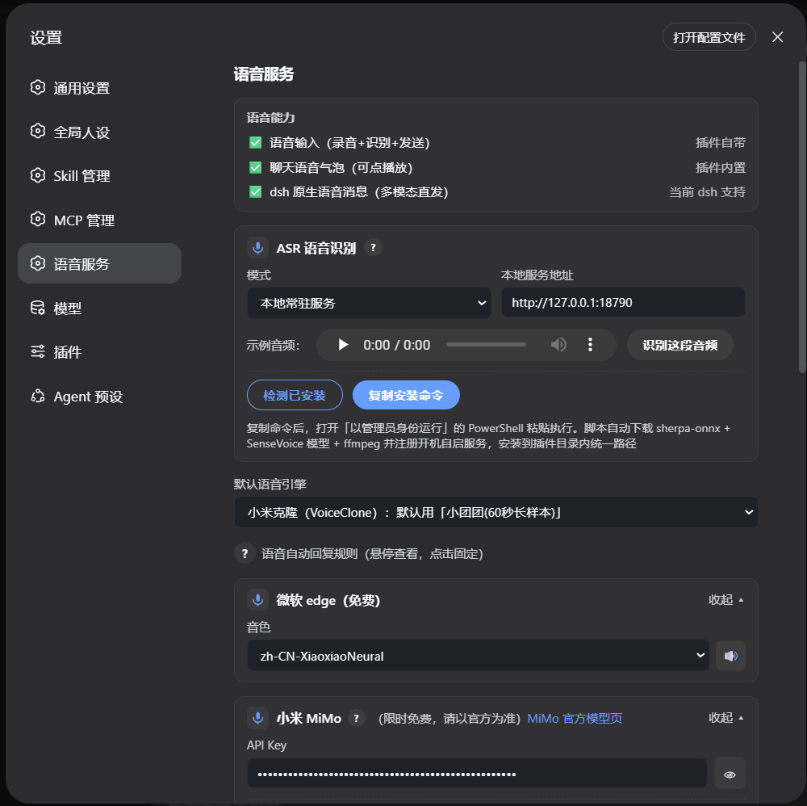

# dsh-input-tools —— DSH Web 多功能增强插件

给 DSH Web 加全套实用能力：**语音**（录音输入 / 多引擎 TTS / 离线 ASR / 音色克隆 / 语音气泡 / AI 语音回复）、**图片**（文本模型也能发图识图）、**余额显示**。

- **host**（服务端）：语音工具 + TTS 六引擎 + ASR + 音色克隆 + 自动语音回复
- **client**（浏览器）：输入框工具条（图片/录音）+ 语音设置页 + 余额显示 + 语音文本复制

## 功能

### 语音
| 能力 | 说明 |
|---|---|
| 录音输入 | 输入框麦克风按钮，录音 → 本地 ASR 识别 → 发送 |
| TTS 六引擎 | auto / 小米 / 音色设计 / 音色克隆 / Edge(免费) / 本地 / 阿里 |
| 离线 ASR | 本地 sherpa-onnx 常驻服务（18790）或命令行模式，不依赖云 |
| 音色克隆 | 参考音频复刻音色，自带示例样本，开箱即用 |
| AI 语音回复 | 用户语音后 AI 自动用语音回（send_voice 工具） |
| 语音气泡 | 用户/AI 语音消息可点击播放，尾部复制转写文本 |

### 图片
- 输入框图片按钮上传 → **文本模型也能发图**：图片转本地路径文本，AI 自动调视觉 MCP 识图后回答
- 附件存储自动生成**带扩展名的别名**（jpg/png/webp→png），zai-vision 等按扩展名校验的
  识图工具可直接读取（源码补丁包含，无需额外配置）

### 余额
- 直连模型时输入框右侧实时显示余额（¥xx）

### 界面截图

**输入框工具条**（图片 + 录音 + 余额）：


**语音设置页 —— 小米 TTS**（三模型分区：TTS / 音色设计 / 音色克隆）：



**语音设置页 —— 本地 TTS 与阿里**：


**语音能力状态与 ASR 配置**：



**聊天语音消息展示**（用户/AI 语音气泡，可点击播放）：


## 安装

### 场景一：已有 dsh 运行环境（源码版或 npm 版）

```bash
dsh plugin --profile web add @oadank/dsh-input-tools
```

装进当前 profile（`~/.dsh/profiles/<name>/node_modules/`），重启 dsh 生效。

### 场景二：从零开始（推荐，一键整合版）

整合版 fork 已内置语音改造 + 本插件 + 一键配置脚本：

```bash
git clone https://github.com/oadank/deepseek-harness.git
cd deepseek-harness
# Windows：
powershell -ExecutionPolicy Bypass -File scripts\setup-profile.ps1
# Linux/macOS：
bash scripts/setup-profile.sh
pnpm install
pnpm run build:web
dsh --profile web
```

setup 脚本自动完成：装插件进 profile → 注册 → 检查 ffmpeg → 提示可选 ASR。**无需再执行 dsh plugin add**。

### 可选：本地 ASR（离线识别）

- **Windows**：管理员 PowerShell 运行 `scripts\install-asr.ps1`（插件包内），自动下载 sherpa-onnx + 模型（约 260MB）、注册 `asr` 服务（18790）
- **Linux**：手动部署 18790 识别服务，或用 ASR 的 cmd/api 模式

### 依赖

- **ffmpeg**（语音转码必需）：Windows `winget install ffmpeg`；Linux `sudo apt install ffmpeg`
- **视觉 MCP**（图片识图必需）：在 dsh 设置里配置至少一个视觉 MCP 服务，AI 用它的工具识图：
  - `zai-vision`（推荐，通用）：`npx -y @z_ai/mcp-server`，配 `Z_AI_BASE_URL=http://localhost:11434/v1/`（本地 ollama 跑 qwen3-vl 等视觉模型），按扩展名校验（已由补丁解决）
  - `visionqa`（本机自建服务）

## 配置

语音设置都在设置页「语音服务」分区（引擎、音色、Key、克隆、ASR 模式），存于 `~/.dsh/voice-config.json`。

## 语音源码补丁（完整体验原生语音消息）

dsh 官方版（npm rc.7 / 官方源码）**契约不支持原生语音消息**（voice 消息气泡、AI 语音回复条）。二选一：

### 方案 A：官方源码 + 破解脚本

```bash
git clone https://github.com/deepseek-ai/deepseek-harness.git
cd deepseek-harness
git checkout 141eb6fef8        # 官方 dsh-0.1.0-rc.8 基线
# 打补丁（脚本自动探测/输入源码位置）：
powershell -ExecutionPolicy Bypass -File <插件目录>\patches\apply-voice-patch.ps1
pnpm install && pnpm run build:web && dsh --profile web
```

### 方案 B：直接用整合版 fork（推荐）

```bash
git clone https://github.com/oadank/deepseek-harness.git
cd deepseek-harness
powershell -ExecutionPolicy Bypass -File scripts\setup-profile.ps1
pnpm install && pnpm run build:web && dsh --profile web
```

> 补丁基线官方 rc.8（141eb6fef8），官方后续更新可能不兼容，请先 checkout 该基线再打。回滚：`git apply -R`。
> npm 版（rc.7）限制：语音输入/合成可用，但语音气泡/AI 语音回复条无法原生显示（完整体验用源码版）。
