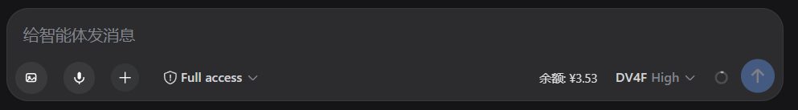
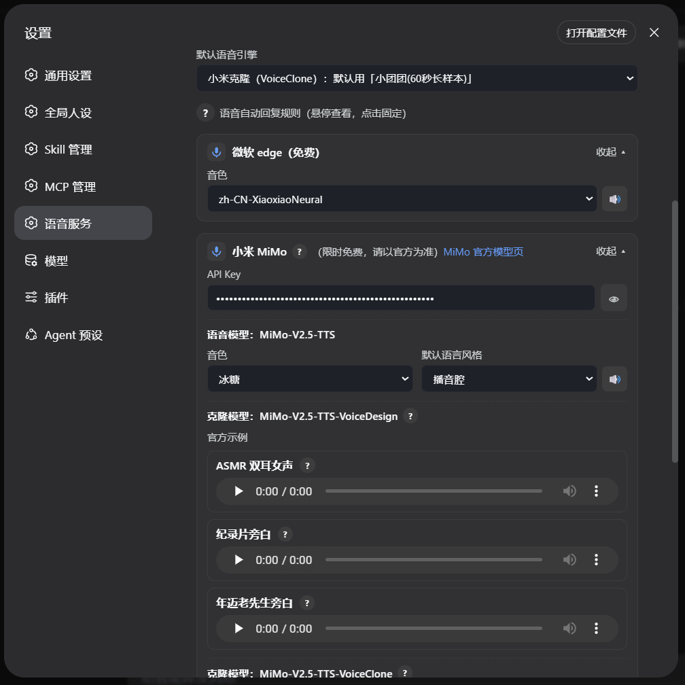
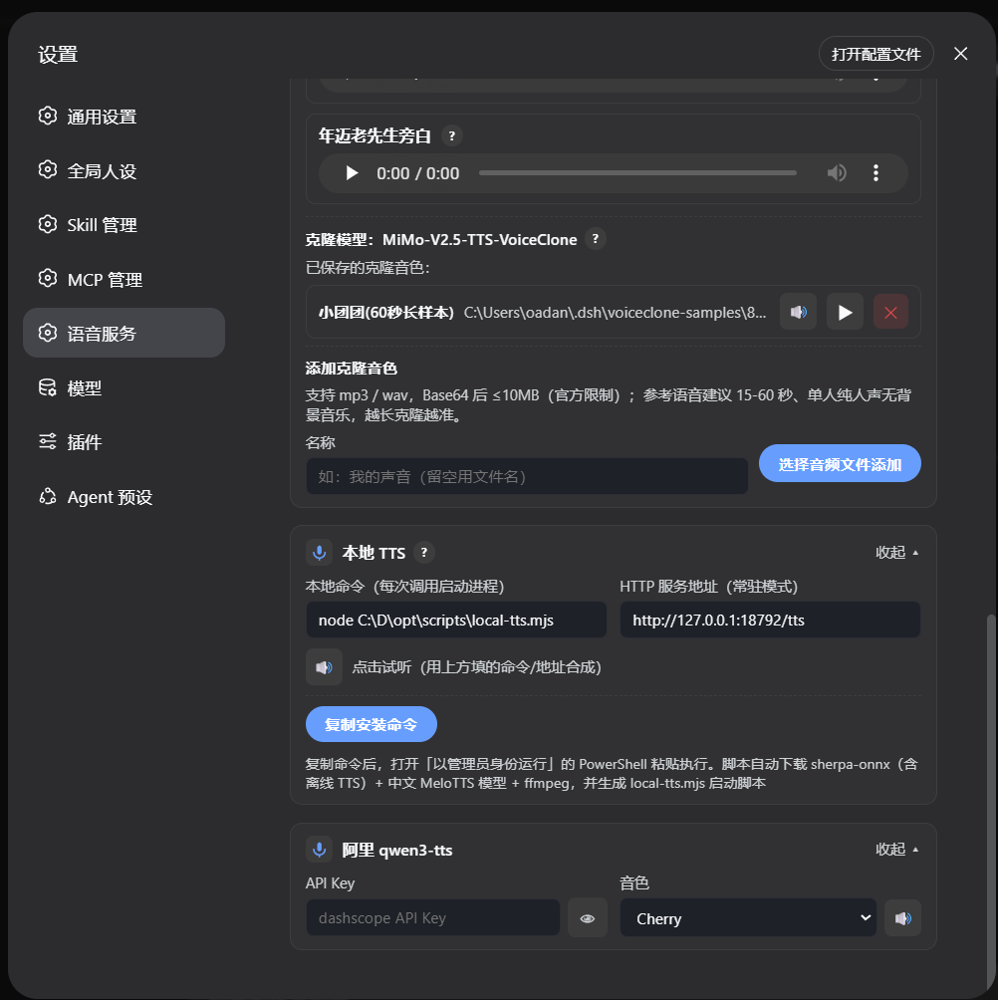
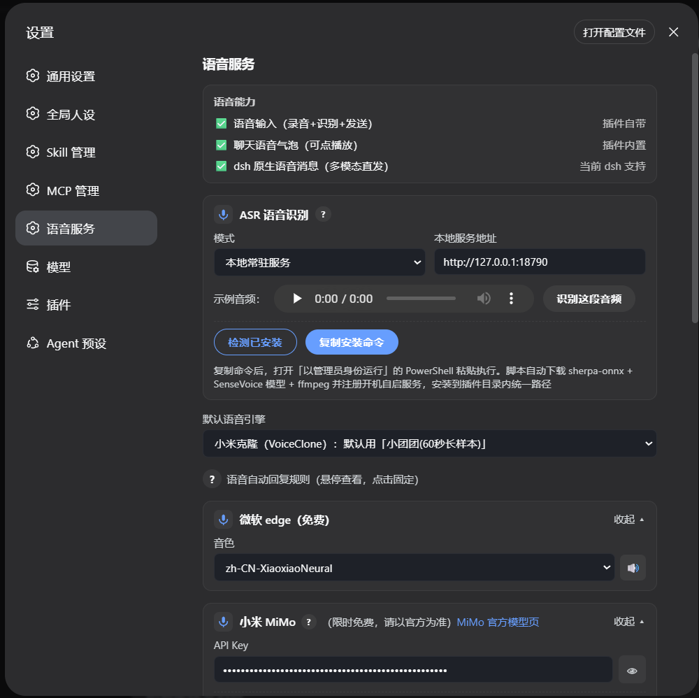
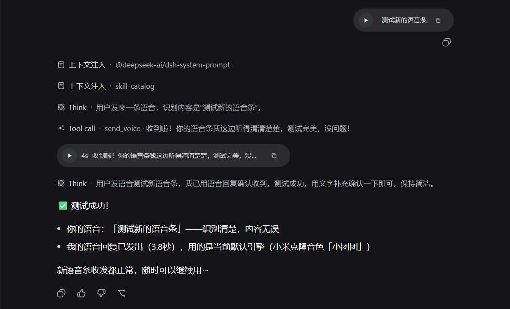

# dsh-input-tools —— DSH Web 多功能增强插件

> 一句话定位：**给 DSH 配上眼睛、耳朵和嘴巴——而且全部免费。**

给 DSH Web 加全套实用能力：**眼睛**（文本模型也能发图识图）、**耳朵**（录音输入 / 离线 ASR）、**嘴巴**（多引擎 TTS / 音色克隆 / AI 语音回复）、**余额显示**。

- **host**（服务端）：语音工具 + TTS 六引擎 + ASR + 音色克隆 + 自动语音回复
- **client**（浏览器）：输入框工具条（图片/录音）+ 语音设置页 + 余额显示 + 语音文本复制
- **免费**：本地部署优先（离线 ASR / 本地 TTS / 本地识图），在线引擎也全是免费档，无需付费 Key

## 功能

### 语音
| 能力 | 说明 |
|---|---|
| 录音输入 | 输入框麦克风按钮，录音 → 本地 ASR 识别 → 发送 |
| TTS 六引擎 | auto / 小米 / 音色设计 / 音色克隆 / Edge(免费) / 本地 / 阿里 |
| 离线 ASR | 本地 sherpa-onnx 常驻服务（18790）或命令行模式，不依赖云 |
| 音色克隆 | 参考音频复刻音色，自带示例样本，开箱即用 |
| AI 语音回复 | 用户语音后 AI 自动用语音回（send_voice 工具） |
| 语音气泡 | 用户/AI 语音消息可点击播放，尾部复制转写文本 |

### 图片
- 输入框图片按钮上传 → **文本模型也能发图**：图片转本地附件路径文本，AI 自动调 **look_image 工具**识图（describe 看图描述 / reverse 像素级反推生图提示词 / text 提取文字）
- 识图后端在设置页「图片识别」独立分区配置：**本地部署**（ollama / sglang / vllm 等 OpenAI 兼容 `/v1` 端点，无需 Key）或**在线云端 API**（填地址 + API Key），统一 OpenAI 兼容格式
- 设置页可一键测试配置连通（内置测试图 + 三模式试跑）、查看/编辑每个模式的提示词（支持恢复默认）

## 架构说明：哪些还需要改 dsh 源码（2026-09-26 全面复核，逐条核对代码）

> 🔴 **本节曾长期失实**：旧版写着"改 `llm-deepseek/serialize.ts`、`llm-pi-ai/context.ts`、`apiproxy/api-proxy.ts`"——经 `git diff dsh-v0.1.7-rc.2` 逐文件核对，**这三处在当前基线（官方 0.1.7-rc.2）已全部不存在**：官方原生了附件/图片管线（`attachment` + `llm-deepseek/files-api`），apiproxy 包整体退役。纯文本模型发图现走**插件零改动链路**：图片转本地附件路径文本 → AI 调 `look_image` 识图。

当前仍依赖 fork 源码的改动只剩**语音消息一簇**（官方无对应扩展点，进官方插件库前需上游化或找钩子）：

| 官方文件 | 改动 | 为什么暂时去不掉 |
|---|---|---|
| `core/session`（types + known-event-types） | `voice/reply`、`image/reply`、`video/reply` 三个 log-only 事件类型 | 事件白名单在 core，插件写入媒体事件目前必须经它 |
| `llm/llm/src/types.ts` + `content.ts`、`attachment` types/index | `VoiceBlock` 内容块类型 | 语音内容块的类型系统引用链 |
| `session/session-format-v2-to-v3/payload.ts` | voice 块迁移支持 | 同上迁移面 |
| `ui-chat` 包内新增（VoiceCard 等）+ 十余处小接线 | 语音气泡/图片条渲染 | **可迁插件**（视频条已在插件 client.js 用 `uiConversation.events.register` 纯插件渲染，语音照此办理即可归还）——待专项 |

另有五处**与媒体无关的通用健壮性补丁**（tailnet 域名信任、PWA 切后台重连、taskkill 全路径、nssm 下目录选择器走 browse、窄屏换行），各带 `[本地改造]` 注释，属"给官方报 bug/PR"的候选，不阻塞插件化。

**除上述外，本插件功能（设置分区/工具条/识图/余额/克隆/`/de`/插件页配置入口）全部走官方扩展点，0 改源码。** 7 个设置分区的配置界面 2026-09-26 起已同时注册进官方「插件」页卡片详情（`plugins.bundle.config`），设置页旧分区为过渡期共存、随后移除。

### 余额
- 直连模型时输入框右侧实时显示余额（¥xx）

### 界面截图

**输入框工具条**（图片 + 录音 + 余额）：



**语音设置页 —— 小米 TTS**（三模型分区：TTS / 音色设计 / 音色克隆）：



**语音设置页 —— 本地 TTS 与阿里**：



**语音能力状态与 ASR 配置**：



**聊天语音消息展示**（用户/AI 语音气泡，可点击播放）：



## 本地 TTS（内置 Hojo-TTS-Light-40M）

语音设置页 → 本地 TTS → 点「复制安装命令」，拿**管理员 PowerShell** 粘贴执行 `scripts/install-local-tts.ps1`：

1. 从 HuggingFace 拉 **Hojo-TTS-Light-40M** 权重（4 个文件约 240MB；主站不通自动切 `hf-mirror.com`，断点续传 + 体积校验）
2. 建**专用瘦 venv**：只装 `onnxruntime` / `onnx` / `numpy` / `tokenizers` / `soundfile`，约 **170MB**
   （venv 与权重都**不进 git、不进安装包**，装机时本地自建）
3. 注册 nssm 常驻服务 `dsh-local-tts`（`127.0.0.1:18792`，开机自启，模型常驻内存）
4. **自检**：`GET /health` + 真合成一段 mp3，两关都过才报成功

装完 **地址由脚本自动写好**（`engines.local.url = http://127.0.0.1:18792/tts`；插件的配置按文件 mtime 实时重读，**不用重启**）；设置页可核对，「本地命令」留空。旧 MeloTTS 的 `cmd` 若还指着 `local-tts.mjs`，脚本会顺手清空（指向别处的自定义命令不动）。

| 细节 | 说明 |
|---|---|
| 落盘位置 | `%USERPROFILE%\.dsh\hojo-tts`（探测顺序：`-InstallDir` → `~\.dsh\hojo-tts` → `C:\D\opt\hojo-tts-light` → `D:\opt\hojo-tts-light`，已有安装复用，不重复占盘） |
| 服务端代码 | 在本插件内（`scripts/hojo-tts/`，含上游 Apache-2.0 的 `onnx_model.py` 与 LICENSE），安装时拷进安装目录 → **插件升级/重装不影响已装服务** |
| 常驻要求 | 服务以 LocalSystem 跑：脚本会把 `HOJO_MODELS` / `FFMPEG` 写进服务环境（注册表 `AppEnvironmentExtra`，`nssm set` 写多值不可靠），`server.py` 自身也有一套 ffmpeg 兜底探测 |
| 幂等 | 权重按最小体积校验、venv 按依赖 import 校验，缺什么补什么；`-Force` 重做，`-SkipService` 只装文件 |
| 旧版 MeloTTS | 已停用（sherpa-onnx VITS + `local-tts.mjs`）。脚本**只检测不自动删**残留，并打印删除命令——`sherpa-onnx` 本体与 `models\sensevoice-int8` 是 ASR 在用，别一起删 |

> 音色：40M 只有预置音色库（`hojo_zh_f_01/02` 中文女声 + 十几个英文男女），**无中文男声、无克隆接口**。要中文男声走小米音色设计。

## 安装

> ⚠️ **npm 注册表上的 0.3.24 是旧壳**（host 121KB/284KB、client 141KB/424KB 对不上本机补丁版），
> `dsh plugin add` 从注册表安装会**丢掉全部本地补丁**。在插件源码归位 git 仓库并重新发版之前，
> 本机/新装都只能用下面"整合版 fork"路径；本机 profile 内的包走 `link:` 指向
> `profiles/node_modules/@oadank/dsh-input-tools`，不受注册表影响。

### 场景一：已有 dsh 运行环境（源码版或 npm 版）

暂不可用（注册表是旧壳，见上方警告）。正确姿势：把本包目录整copy到
`~/.dsh/profiles/node_modules/@oadank/` 下，再 `dsh plugin --profile web add` 走 link（本机已如此）。

> ⚠️ **不要给本插件加回 `@deepseek-ai/*` 依赖**（例如 `@deepseek-ai/dsh-tools`）。核心包由宿主的运行环境提供，插件里 `import { defineTool } from '@deepseek-ai/dsh-tools'` 会顺着 profile 的 `node_modules` 解析到宿主那一份。
> 一旦写进 `dependencies`，pnpm 会把**另一个版本的核心包**（如 `dsh-tools@0.1.0-rc.8`）装进 profile，遮蔽宿主自己的同名插件行 —— 桌面客户端（0.2.0-rc.2）的版本闸门会直接禁用宿主自己的 `tools` 行（日志：`disabling profile plugin row "tools": Plugin @deepseek-ai/dsh-tools@0.1.0-rc.8 is incompatible with dsh 0.2.0-rc.2`），导致 `agent-loop` 等 11 个插件全部 pending、**整个客户端启动不了**。0.3.25 起该依赖已移除（2026-10-04 实测血案）。

### 场景二：从零开始（推荐，一键整合版）

整合版 fork 已内置语音改造 + 本插件 + 一键配置脚本：

```bash
git clone https://github.com/oadank/deepseek-harness.git
cd deepseek-harness
# Windows：
powershell -ExecutionPolicy Bypass -File scripts\setup-profile.ps1
# Linux/macOS：
bash scripts/setup-profile.sh
pnpm install
pnpm run build:lib       # ⚠️ 必须！全新 clone 无编译产物，跳过会报 Failed to resolve @deepseek-ai/dsh-client-web
pnpm run build:web
dsh --profile web
```

setup 脚本自动完成：装插件进 profile → 注册 → 检查 ffmpeg → 提示可选 ASR。**无需再执行 dsh plugin add**。

### 本地 ASR（语音转文字）

- **默认走官方内置（official 模式）**：dsh 客户端自带 SenseVoice 识别（`@deepseek-ai/dsh-experimental-voice-input-bundle`，运行时在 app.asar 内、模型在 `~\.dsh\speech-to-text\`，首次使用自动准备）——**零安装、零后台服务**，设置页选「官方内置」或点「检测语音识别」自动切换。
- 历史兼容：`本地常驻服务(18790)`/`本地命令` 两种旧模式仍可配置（第二套 sherpa 部署已退役，不再提供一键安装脚本）；也可用在线 API 模式。

### 依赖

- **ffmpeg**（语音转码必需）：Windows `winget install ffmpeg`；Linux `sudo apt install ffmpeg`
- **视觉 MCP**（图片识图必需）：在 dsh 设置里配置至少一个视觉 MCP 服务，AI 用它的工具识图：
  - `zai-vision`（推荐，通用）：`npx -y @z_ai/mcp-server`，配 `Z_AI_BASE_URL=http://localhost:11434/v1/`（本地 ollama 跑 qwen3-vl 等视觉模型），按扩展名校验（已由补丁解决）
  - `visionqa`（本机自建服务）

## 配置

语音设置都在设置页「语音服务」分区（引擎、音色、Key、克隆、ASR 模式），存于 `~/.dsh/voice-config.json`。

## 语音消息渲染的归属（2026-09-26 定调）

语音气泡 / AI 语音回复条的**渲染代码正从官方仓库迁入本插件**（视频条已证明纯插件可行：`uiConversation.events.register` + 自绘组件，0 改官方源码）。迁移完成前，该渲染暂居 fork 的 `ui-chat` 包；完成后 fork 对官方源码的改动只剩 `core/session` 事件类型等无法插件化的少数项（见「架构说明」表）。
